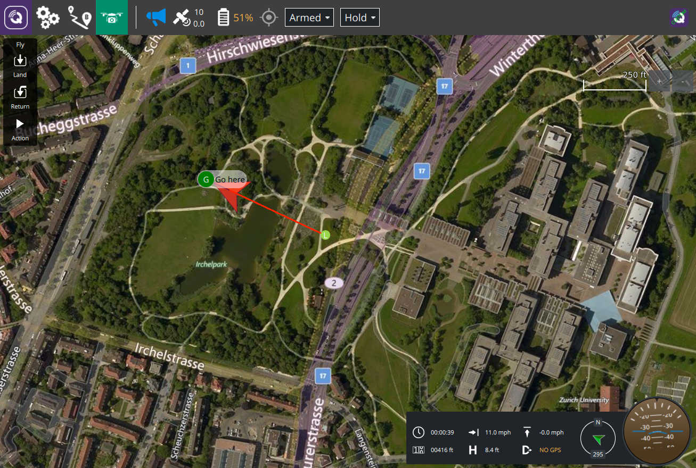

# QGroundControl Ground Control Station

## Custom Build Example

To build this sample custom version:

* Clean you build directory of any previous build
* Rename the directory from `custom-example` to `custom`
* Change to the `custom` directory
* Run `python updateqrc.py`
* Build QGC

More details on what a custom build is and how to create your own can be found in the [QGC Dev Guide](https://dev.qgroundcontrol.com/en/custom_build/custom_build.html).

The main features of this example:

* Assumes an "Off The Shelf" purchased commercial vehicle. This means most vehicle setup is hidden from the user since they should mostly never need to adjust those things. They would be set up correctly by the vehicle producing company prior to sale.
* The above assumption cause the QGC UI to adjust and not show various things. Providing an even simpler experience to the user.
* The full experience continues to be available in "Advanced Mode".
* Brands the build with various custom images and custom color palette which matches corporate branding of the theoretical commercial company this build is for.
* Customizes portions of the interface such as you can see in the above screenshot which shows a custom instrument widget replacing the standard QGC ui.
* It also overrides various QGC Application settings to hide some settings the users shouldn't modify as well as adjusting defaults for others.
* The source code is fully commented to explain what and why it is doing things.

> Important Note: This custom build is not automatically built each time regular QGC code changes. This can mean that it may fall out of date with the latest changes in QGC code. This can show up as the `python updateqrc.py` steps failing due to upstream resource changes. Or possibly fail to compile because the plugin mechanism for custom builds has changed. If this happens please notify the QGC devs and they will bring it up to date. Or even better, submit a pull for the fix yourself!

also:
https://discuss.px4.io/t/qgroundcontrol-ui-customization/4086
https://discuss.px4.io/t/plugin-qml-architecture/19332

//////////////////////////////////////////////////////////////////////////////////////////////
// CustomAutoPilotPlugin.h/cc

CustomAutoPilotPlugin {
fields:
	QVariantList _components;
	
methods:
	constructor:
		set: trigger _advancedChanged (custom event) on Core::showAdvancedUIChanged
	
	_advancedChanged:
		refill UI components with custom vehicleComponents()
		
	const QVariantList& vehicleComponents:
		select UI that shows up in _vehicleComponents
}

//////////////////////////////////////////////////////////////////////////////////////////////
// CustomFirmwarePlugin.h/cc

CustomFirmwarePlugin {
fields:
	QVariantList _toolIndicatorsList;
	
methods:
	constructor:
		for all flight modes:
			set: mode.canBeSet = (if it's "hold" or "rtl" or "mission")
	
	autopilotPlugin:
		return CustomAutoPilotPlugin
		
	toolIndicators:
		if (_toolIndicatorsList is empty)
			load default FirmwarePlugin::toolIndicators
			remove RCRSSIIndicator
	
	hasGimbal:
		tell the core that it has gimbal; supports pitch and yaw, but no roll
}

//////////////////////////////////////////////////////////////////////////////////////////////
// CustomFirmwarePluginFactory.h/cc

CustomFirmwarePluginFactory {
fields:
	CustomFirmwarePlugin* _pluginInstance;
	
methods:
	constructor: default _pluginInstance(nullptr)
	
	supportedFirmwareClasses:
		return { PX4 }
	
	supportedVehicleClasses:
		return { MultiRotor }
		
	firmwarePluginForAutopilot:
		if (autopilot == PX4)
			if (!_pluginInstance)
				_pluginInstance = new CustomFirmwarePlugin;
			return _pluginInstance;
		else return nullptr;
}

//////////////////////////////////////////////////////////////////////////////////////////////
// CustomPlugin.h/cc

CustomFlyViewOptions {
methods:
	showMultiVehicleList: return false
	showInstrumentPanel: return false
}

CustomOptions {
fields:
	CustomFlyViewOptions* _flyViewOptions;
	
methods:
	flyViewOptions:
		if (!_flyViewOptions)
			_flyViewOptions = new CustomFlyViewOptions;
		return _flyViewOptions;
		
	showFirmwareUpgrade: from default showAdvancedUI()
		
	wifiReliableForCalibration: true
}

CustomPlugin {
fields:
    CustomOptions* _options;
    QVariantList _customSettingsList;

methods:
	constructor:
		_options = new CustomOptions;
		_showAdvancedUI = false;
	
	setToolbox:
		default QGCCorePlugin::SetToolbox
		but then set: trigger _advancedChanged (custom event) on Core::showAdvancedUIChanged
		
	_advancedChanged:
		change showFirmwareUpgrade
		
	settingsPages:
		choose what settings pages to show on _customSettingsList
		
	overrideSettingsGroupVisibility:
		show or hide specific settings groups (e.g. BrandImageSettings)
	
	adjustSettingMetaData:
		override some settings (e.g.:
			offlineEditingFirmwareClassName -> FirmwareClassPX4
			offlineEditingVehicleClassName -> VehicleClassMultiRotor)
	
	paletteOverride:
		overrides default colors
	
	createQmlApplicationEngine:
		use default QGCCorePlugin::createQmlApplicationEngine
		but then addImportPath("qrc:/Custom/Widgets") to register custom QML module
}